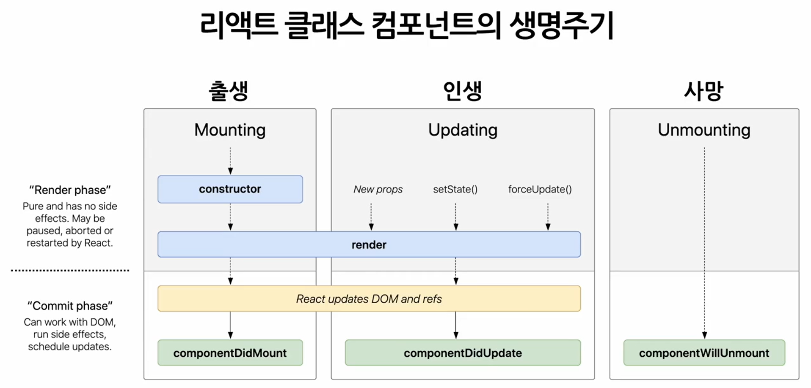
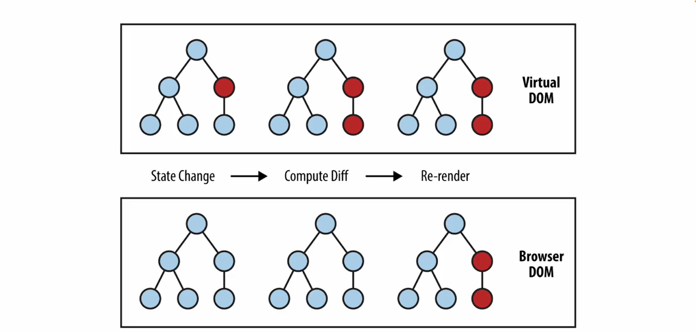
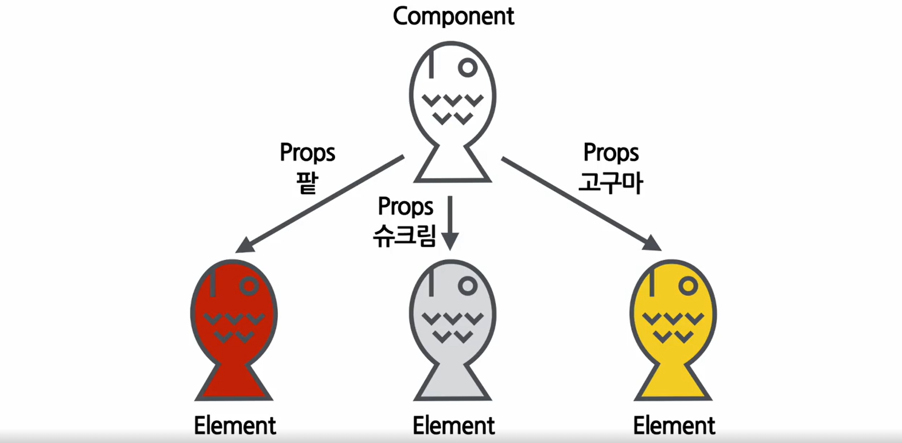
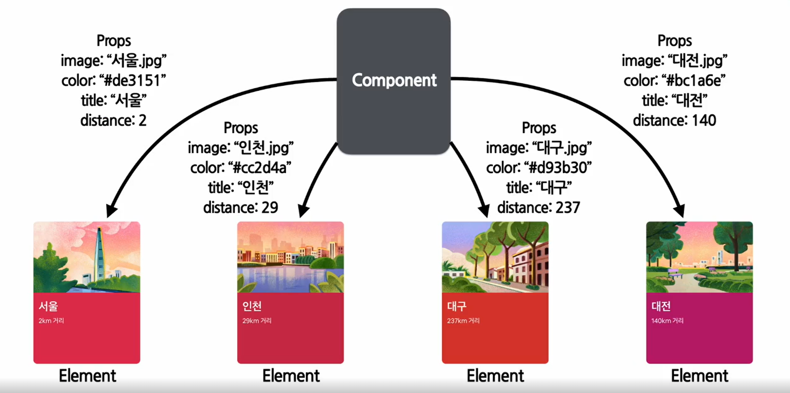
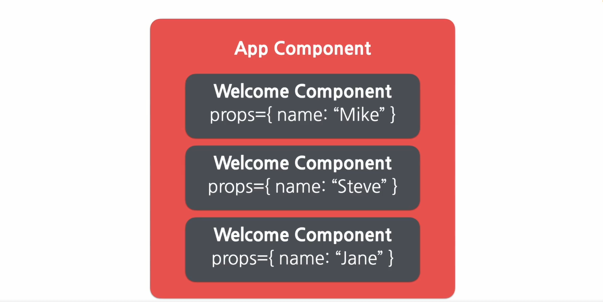
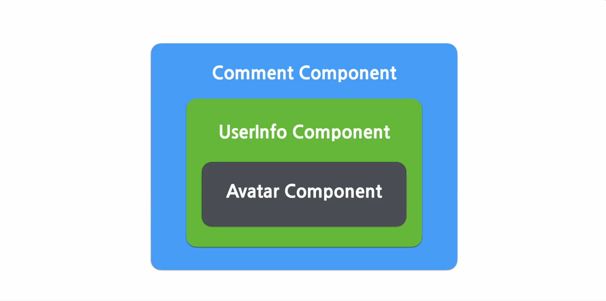

# 4강

## JSX의 정의와 역할

JSX란 : JavaScript + XML/HTML

예시
``` jsx
const element = <h1>Hello, word!</h1>;
```

JSX를 사용한 코드
``` jsx
const element = (
    <h1 clssName="greeting"> Hello, world!</h1>
)
```

JSX를 사용하지 않은 코드
``` jsx
const element = React.createElement(
    'h1',
    { className: 'greeting'},
    'Hello, world!'
)
```


## JSX의 장점 및 사용법

+ 가독성 향상
+ 버그를 발견하기 쉬움
+ 간결함
+ Injection Attacks 방어 

``` jsx
const name = '소플';
const element = <h1>안녕, {name}</h1>;

React.DOM.render(
    element,
    document.getElementById('root')
);
```


# 5강

## Elements의 정의와 생김새

Elements란 : 리액트 앱을 구성하는 가장 작은 블록들



+ 실제 브라우저의 DOM에 존재하는 엘리먼트 > DOM 엘리먼트
+ 리액트에 Virtual DOM 존재하는 엘리먼트는 > 리액트 엘리먼트


``` jsx
React.createElement(
    type,  // 태그
    [props],  // 속성
    [...children]  // 자식 엘리먼트
)
```

``` jsx
function Button(props) {
    return(
        <button className={`bg-${props.color}`}>
          <b>
            {props.children}
          </b>
        </button>  
    )
}

function ConfirmDialog(props) {
    return(
        <div>
            <p>내용을 확인하셨으면 확인 버튼을 눌러주세요. </p>
            <Button color='green'>확인</Button>
        </div>
    )    
}
```

``` jsx
Button 함수 
{
    type: 'button',
    props: {
        className: 'bg-${props.color}',
        children: {
            type: 'b',
            props: {
                children: 'props.children'
            }
        }
    }
}

ConfirmDialog 함수
{
    type: 'div',
    props: {
        children: [
            {
                type: 'p',
                props: {
                    children: '내용을 확인하셨으면 확인 버튼을 눌러주세요.'
                }
            },
            {
                type: Button,
                props: {
                    color: 'green',
                    children: '확인'
                }
            }
        ]
    }
}
```

## Elements의 특징 및 렌더링하기

im + mutable = immutable(불변성)


[컴포넌트 = 붕어빵 틀, 엘리먼트 = 생성된 붕어빵]


 
``` jsx
function tick() {
    const element = (
        <div>
            <h1>안녕, 리액트!</h1>
            <h2>현재 시간: {new.Date().toLocaleTimeString()}</h2>
        </div>       
    );

    ReactDOM.render(element, document.getElementById('root'));
}

setInterval(() => {
    tick();
}, 1000);
```

# 6강

## Components와 Props의 정의

Props -> React component -> React element






## Props의 특징 및 사용법

모든 리액트 컴포넌트는 props를 직접 바꿀 수 없고, 같은 Props에 대해서는 항상 같은 결과를 보여줄것 

``` jsx
function App(props) {
    return(
        <Layout
            width={2560}
            height={1440}
            header={
                <header title="소플의 블로그입니다." />
            }
            footer= {
                <Footer />
            }
            />
    );
}
```

``` jsx
React.createElement(
  Layout,
  {
    width: 2560,
    height: 1440,
    header: React.createElement(
       header, 
      { title: "소폴의 블로그입니다." }
    ),
    footer: React.createElement(
        footer
    ),
  }
);
```

## Component 만들기 및 렌더링

``` jsx
Function Component

function Welcome(props) {
    return <h1>안녕, {props}</h1>;
}
```

``` jsx
Class Component

class Welcome extends React.Component{
    render() {
        return <h1>안녕, {this.props.name}</h1>;
    }
}
```

HTML div 태그로 인식

``` jsx
const element = <div />;
```

Welcome이라는 리액트 Component로 인식

``` jsx
const element = <Welcome name="리액트" />;
```

``` jsx
function Welcome(props) {
    return <h1>안녕, {props.name}</h1>;
}

const element = <Welcome name="인제" />;
ReactDOM.render(
    element,
    document.getElementById('root')
)
```

#Component 합성과 추출
-------------------------

Component 합성

``` jsx
function Welcome(props) {
    return <h1>Hello, {props.name}</h1>;
}

function App(props) {
    return(
        <div>
         <Welcome name="Mike" />
         <Welcome name="Steve" />
         <Welcome name="Jane" />
        </div>
    )
}

ReactDOM.render(
    <App/>,
    document.getElementById('root')
);
```




Component 추출

``` jsx
function Comment(props) {
    return (
        <div className="comment">
         <div className="user-info">
          
           <div className="user-info-name">
            {props.author.name}
           </div>
         </div>
         
         <div className="comment-text">
          {props.text}
         </div>

         <div className="comment-date">
          {formatDate(props.date)}
         </div>
        </div>
    );
}

props = {
    author: {
        name: "소플",
        avatarUrl: "https://...",
    },
    text: "댓글입니다.",
    date: Date.now(),
}
```

``` jsx
function Comment(props) {
    return (
        <div className="comment">
         <div className="user-info">
          <Avatar  user ={props.author} />
           <div className="user-info-name">
            {props.author.name}
           </div>
         </div>
         
         <div className="comment-text">
          {props.text}
         </div>

         <div className="comment-date">
          {formatDate(props.date)}
         </div>
        </div>
    );
}

function Avatar(props) {
    return(
        
    );
}
``` 

``` jsx
function Comment(props) {
    return (
        <div className="comment">
          <UserInfo user ={props.author} />      
         <div className="comment-text">
          {props.text}
         </div>
         <div className="comment-date">
          {formatDate(props.date)}
         </div>
        </div>
    );
}

function UserInfo(props) {
    return(
      <div className="user-info">
        <Avatar user={props.user} />
        <div className="user-info-name">
            {props.user.name}
        </div>
       </div>
    );
}
```




